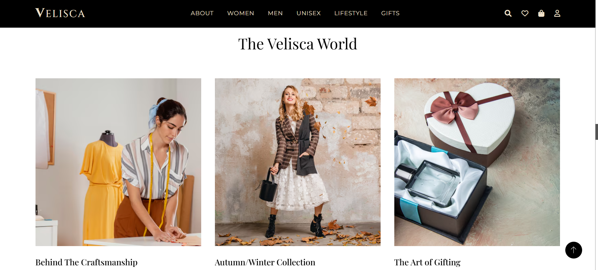
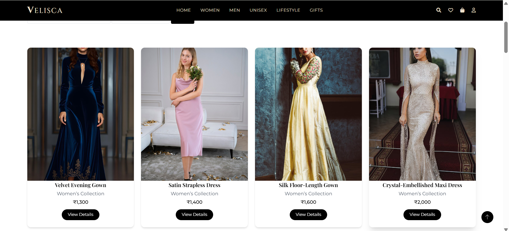

# 💎 Velisca – Premium Fashion & Lifestyle Website

## 🌸 Introduction

**Velisca** is a premium fashion and lifestyle e-commerce website designed to offer users a luxury online shopping experience. Inspired by high-end fashion houses like Gucci and Prada, Velisca brings together elegant design, smooth navigation, and beautifully curated products across fashion, accessories, and home collections.

---

## ❓ Why Velisca?

> In a world flooded with generic online stores, Velisca stands out by blending minimalism with luxury.

- Designed for fashion enthusiasts who appreciate quality and class.
- Offers curated product collections with a premium feel.
- Created as a full-stack project using PHP and MySQL, showcasing web development and UI/UX skills.

---

## ✨ Features

- 🖤 Elegant and modern UI with a luxurious color palette  
- 🛍️ Categories: Men’s Fashion, Women’s Fashion, Accessories, Home & Lifestyle, Special Collections  
- 🔎 Filter products by category and price  
- 🧾 Product detail pages with "Add to Cart" and "Add to Wishlist" options  
- 🛒 Shopping cart and wishlist management  
- 📱 Fully responsive design  
- 💬 Contact form and About page  
- 🧠 Scalable structure for future integration of user accounts and admin panel

---

## 🖼️ Screenshots






---

## 🌐 Live Demo

http://manvitha.free.nf/


---

## 🛠️ Tech Stack

**Frontend**  
- HTML5  
- CSS3  
- JavaScript  
- TailwindCSS

**Backend**  
- PHP  
- MySQL (via phpMyAdmin)

---

## 🧬 Cloning and Setup

1. **Clone the Repository**
   ```bash
   git clone https://github.com/yourusername/velisca.git

2. 🗂️ **Import Database**

1. Open **phpMyAdmin**
2. Create a new database named **`velisca`**
3. Import the **`velisca.sql`** file from the `/database` folder

3. 💻 **Run on Localhost**

1. Use **[XAMPP](https://www.apachefriends.org/index.html)** or any other local server
2. Place the project folder inside the `htdocs` directory
3. Start **Apache** and **MySQL** from the XAMPP control panel
4. Open your browser and visit:  
   http://localhost/velisca/index.html

---

## 🚀 Future Enhancements

- 👤 User **login/signup** system  
- 🛠️ **Admin dashboard** to manage products and orders  
- 💳 **Payment gateway** integration  
- ⭐ **Product reviews and ratings**  
- 📧 **Email notifications** and **newsletter subscriptions**  
- 🌍 **Multilingual** and **multi-currency** support  

---

Made with ❤️ by **Manvitha Pola**

